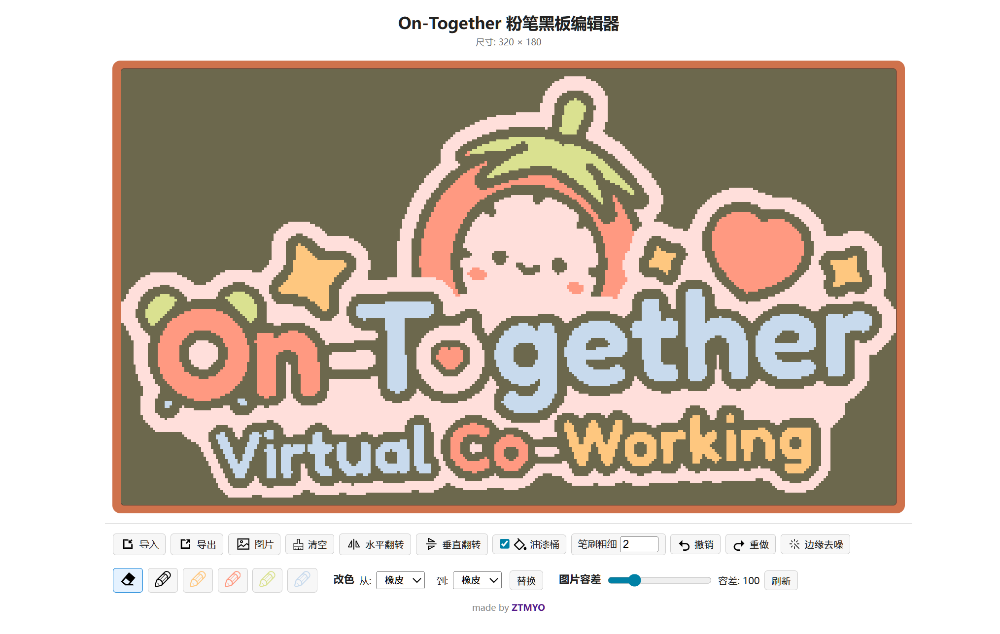
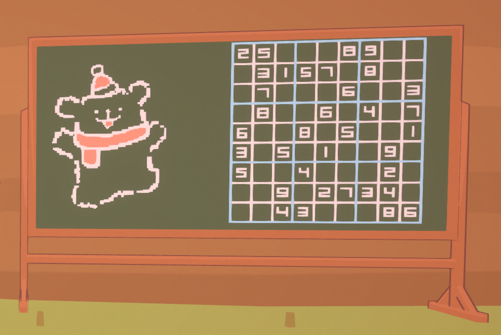

# On-Together Tools
这个仓库主要包含为游戏《On-Together》制作的自用模组，同时附带了一些基于 Python 的宏脚本，用于自动化绘制、连点等辅助操作。

> 本项目仅供学习与个人娱乐使用，无商业用途。

---

## 自用 mod 说明 
以下模组位于 `自用mod/` 目录，供个人使用与测试。请在使用前了解模组功能并遵守游戏规则。

- **On-Together_BetterFishing**
  - 功能：单击跳过钓鱼小游戏；随机化鱼的大小（奖励相应调整）；增加钓鱼杆投掷距离。

- **ShowYourFish**
  - 功能：捕获的鱼不会自动放生，可展示给其他玩家，期间可以移动或吹泡泡。

- **SpectatorMod**
  - 功能：按 `F6` 进入/退出旁观者模式（灵魂出窍）。
  - 操作：`C` 上升，`Shift` 下降，按住 `Ctrl` 加速。

- **PianoMidiMod**
  - 功能：支持通过外接 MIDI 设备演奏游戏内乐器，支持多个八度。
  - 依赖：需要先安装 `MidiJackPlugin`（放到游戏根目录）。

- **MidiJackPlugin**
  - 说明：`PianoMidiMod` 的前置插件，需放置于游戏根目录以使 MIDI 功能正常工作。

- **On-Together_sodaRush**
  - 功能：支持按 `Shift` 的“火影跑”移动效果，可与其它移动模组叠加使用。

- **officerballs.MoveTweaks**
  - 功能：`Shift` 加速移动；添加冲刺和潜行键（`Shift+Control`）；按住鼠标中键可旋转人物；使泡泡糖持续时间无限且使用时不消耗。

- **MoveWhenTask**
  - 功能：解除玩家在专注状态下的移动限制，支持专注时通过方向键自由移动，可浮空、可穿墙；操作：`Shift+↓` 下降，`Shift+↑` 上升。

- **NewFishNotifier**
  - 功能：在钓鱼时解锁新鱼类图鉴条目时，在聊天框中显示提示文字。

- **UmbrellaMod**
  - 功能：在聊天框输入 /umbrella 可使玩家手持雨伞或收起雨伞。

- **SystemTimeMod**
  - 功能：在游戏左上角显示系统时间，点击可为切换为12小时制。

- **ShapeDrawMod**
  - 功能：绘图辅助工具，可在黑板上快速绘制直线、矩形、圆形、三角形、五角星等图形，F7切换模式，Shift 临时直线，左键按下预览，左键松开绘制，右键取消预览，Ctrl矩形/三角/五角星旋转

- **ChatKeepMod & chat_viewer.html**
  - **ChatKeepMod**：将玩家所在房间内的聊天消息保存到本地。
  - **chat_viewer.html**：位于 `自用mod/`，用于解析保存的聊天记录并提供直观的展示界面。

- **CopyPaintMod & ChalkBoard.html**
  - **CopyPaintMod**：支持将黑板上的画作复制到本地文件并在任意黑板上粘贴。操作：对准黑板时按 `Ctrl+C` 复制当前黑板；对准目标黑板按 `Ctrl+V` 粘贴，详情参考游戏内的 UI。
  - **ChalkBoard.html**：黑板绘图编辑器，包含游戏内同款的绘画功能，也可以配合 `CopyPaintMod` 实现画作数据的导入导出，支持将图片转换为画作。
  - **效果图**
    - 编辑器界面示意：
    - 游戏中黑板画效果：

> ⚠️ 提示：这些模组为个人自用与测试用途，仅供参考。请勿在违反游戏条款或破坏他人游戏体验的情况下使用。

---

## Python 宏脚本说明

Python 宏脚本位于 `辅助脚本/` 目录，使用 `pynput` 库监听鼠标和键盘事件，实现自动化绘制、连点等功能，帮助在游戏中快速完成某些操作。

### 文件说明

- **快捷键绘制图案.py**：使用键盘快捷键触发绘制操作，支持圆形、矩形、线段等图形的快速绘制。
- **侧键连点.py**：使用鼠标侧键触发连点操作。用于需要快速点击的场景。
- **侧键绘制点阵画.py**：从 `dots.txt` 文件读取点阵图案数据，使用鼠标侧键绘制点阵画。图案由点（.）和空格组成。
- **绘制数独.py**：绘制数独网格、粗分隔线和数字，支持从预设谜题填充。
  - 数独绘制示意图：
- **dots.txt**：点阵图案的数据文件，用于 `绘制点阵画.py`。
- **富文本编辑器.html**：用于编辑并预览自定义富文本颜色格式。

### 依赖

- Python 3.x
- `pynput` 库：用于监听鼠标和键盘事件。

安装依赖：

```bash
pip install pynput
```

### 使用方法

1. 确保 Python 环境已安装并配置好。
2. 进入 `辅助脚本/` 目录，运行相应的脚本（例如：`python 快捷键绘制图案.py`）。
3. 根据脚本提示操作鼠标和键盘。

#### 快捷键绘制图案.py

- 按键说明：
  - **C 键（画圆）**  
    第一次按 `C`：记录当前鼠标位置为圆心。  
    移动鼠标到圆周上的一点，再次按 `C`：以两点距离为半径绘制圆形。

  - **R 键（画矩形）**  
    第一次按 `R`：记录当前鼠标位置为矩形第一个顶点（逻辑上为左上角）。  
    移动鼠标到对角点（通常为右下角），再次按 `R`：以两点为对角绘制矩形边框。

  - **L 键（画线段）**  
    第一次按 `L`：记录当前鼠标位置为直线起点。  
    移动鼠标到终点位置，再次按 `L`：在两点之间绘制一条直线。

  - **T 键（三角形）**  
    第一次按 `T`：记录当前鼠标位置为三角形第一个顶点。  
    第二次按 `T`：记录第二个顶点。  
    第三次按 `T`：记录第三个顶点，并依次连接三条边绘制三角形。

  - **P 键（暂停）**  
    在绘制过程中按 `P`：中途停止当前图形的后续绘制步骤（包括圆形、矩形、线段和三角形）。

#### 绘制点阵画

- 确保 `dots.txt` 文件在同一目录。
- 鼠标移动到起点，按侧键开始绘制点阵图案。

### 注意事项

- 这些脚本仅用于娱乐和学习目的。请遵守游戏规则，避免使用宏脚本违反游戏条款。
- 首次运行前请先在安全环境中验证。

### 贡献

欢迎提交问题或改进建议。

